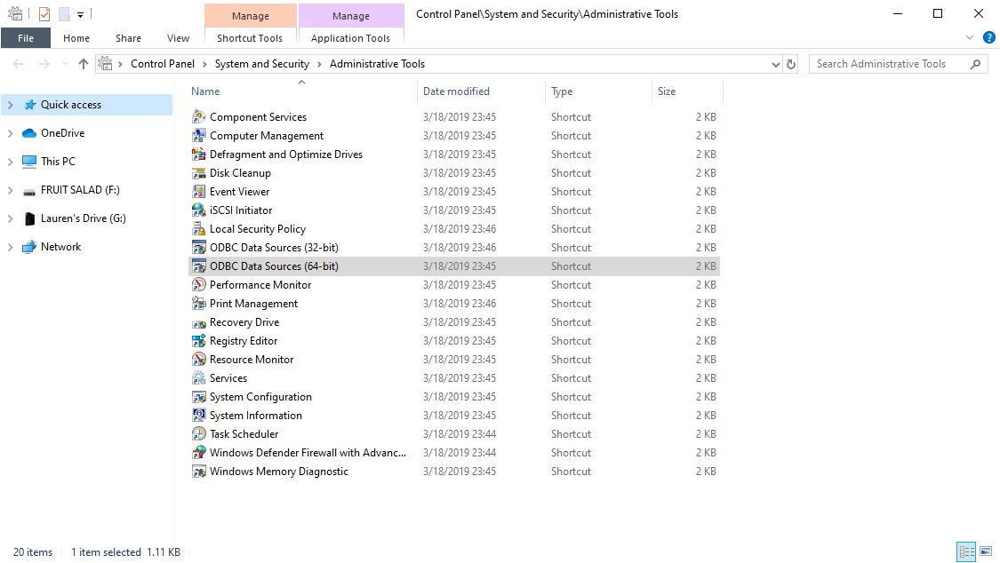

# Connecting R to a MS Access Database

## References
- R Studio- [Connect to a Database](https://db.rstudio.com/getting-started/connect-to-database)
- MS Office Drivers- [Adding an ODBC data source](https://support.office.com/en-us/article/administer-odbc-data-sources-b19f856b-5b9b-48c9-8b93-07484bfab5a7)
- RDocumentation- [DBI Package](https://www.rdocumentation.org/packages/DBI/versions/0.5-1)
- RDocumentation- [odbc Package](https://www.rdocumentation.org/packages/odbc/versions/1.0.1)

## Definitions
**ODBC** : "Open Database Connectivity" this is a standard API (application programming interface) for accessing database management systems

**DSN** : "Data Storage Name" this stores the connection information for your files in a text file not in the windows registry so that

## How to Connect your Access Database to R

### Create a MS Access Driver Specific for your Access DB
1. Click **Start**, and then click **Control Panel**  
  (You may need to search for **Control Panel** in the Windows Start Menu)
2. In the **Control Panel**, click **Administrative Tools**
3. In the **Administrative Tools** windows select **ODBC Data Sources (64-bit)** unless you want to make a 32-bit driver. This will be dependant on which version (32-bit or 64-bit) you are running of Access.

4. For adding a database is the local to your computer select the **User DSN** tab.
5. Click **Add**

6. Select the "Microsoft Access Driver (\*.mdb, \*.accdb)" driver type to use, and then click **Finish**.

7. Follow the instructions and enter the "Data Source Name" and a short Description of the database and click the "Select" button to navigate to the location of your database on your local machine.

8. Click **OK** in the **Select Database** window then **OK** in the **ODBC Microsoft Access Setup** window

9. You should now see your newly created database driver in the list of available  User Data Sources

### Install and load packages in R
- `library(ODBC)`
    - This is the library that will establish a connection between your
- `library(DBI)`
    - Once connected with the database this library will allow you to put things out of the database

### Connect to the database, Run your analysis, and Close the connection
`connection <- dbConnect(odbc::odbc(), "My_Database")`  
`odbc_result <- DBI::dbReadTable(connection, "Fish_Abundance")`  
`as_tibble(odbc_result)` #You can now use  the result as a typical tibble  
`odbcCloseAll()`   #When you are finished be sure to sever the connection to the database
